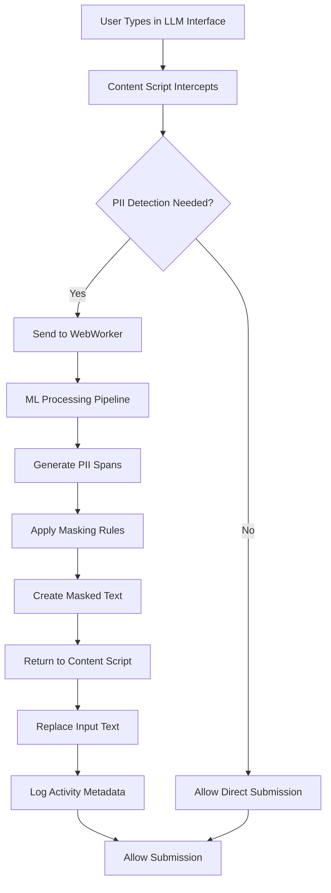

# Data Flow Analysis

## Overview

This document provides detailed analysis of data flows within the PII Checker Chrome Extension, covering all information pathways from user input to final output, with emphasis on privacy and security controls at each stage.

## High-Level Data Flow



## Detailed Data Flows

### 1. User Input Processing

**Flow**: User Input → Content Script → Validation → Processing Queue

| Stage | Data | Security Controls | Privacy Controls |
|-------|------|------------------|------------------|
| **Input Capture** | Raw user text | Input sanitization, XSS prevention | No storage, immediate processing |
| **Validation** | Sanitized text | Length limits, content filtering | No logging of rejected input |
| **Queuing** | Validated text | Memory-only queue, no persistence | Automatic queue clearing |

**Data Transformations**:
- Raw input → Sanitized string
- Length validation (max: 50,000 characters)
- Script tag removal and HTML entity decoding

### 2. PII Detection Pipeline

**Flow**: Text Input → Regex Analysis → NER Processing → Deny-list Matching → Confidence Scoring

#### 2.1 Regex Recognition

```
Input Text → Regex Patterns → Match Results → Confidence Assignment
```

**Data Elements**:
- **Input**: Text string
- **Processing**: Pattern matching against predefined regex rules
- **Output**: Array of potential PII matches with positions

**Security Controls**:
- Regex timeout prevention (ReDoS protection)
- Pattern validation before execution
- Memory usage limits

**Privacy Controls**:
- No storage of intermediate results
- Immediate cleanup of match objects

#### 2.2 Named Entity Recognition (NER)

```
Text → Tokenization → Model Inference → Entity Classification → Span Generation
```

**Data Elements**:
- **Input**: Tokenized text segments
- **Processing**: ML model inference via transformers.js
- **Output**: Named entity spans with confidence scores

**Security Controls**:
- WebWorker isolation from main thread
- Model integrity verification
- Processing timeout mechanisms

**Privacy Controls**:
- Model runs entirely on-device
- No external API calls
- Immediate cleanup of processing artifacts

#### 2.3 Deny-list Matching

```
Text → Exact Pattern Matching → Validation Rules → Match Confirmation
```

**Data Elements**:
- **Input**: Text segments
- **Processing**: Exact string matching against known patterns
- **Output**: High-confidence PII matches

**Security Controls**:
- Pattern list integrity verification
- Input validation before matching
- DoS protection via limits

**Privacy Controls**:
- No storage of matched patterns
- Immediate result processing

### 3. Span Merging & Conflict Resolution

**Flow**: Multiple Detection Results → Overlap Analysis → Priority Resolution → Merged Spans

**Conflict Resolution Logic**:
1. **Confidence Priority**: Higher confidence scores take precedence
2. **Source Priority**: Regex > Deny-list > NER for conflicts
3. **Coverage Priority**: Longer spans preferred over shorter ones
4. **Type Priority**: More specific PII types preferred

**Data Transformations**:
- Individual spans → Merged span array
- Duplicate removal
- Position normalization

### 4. Text Masking Application

**Flow**: Original Text + PII Spans → Replacement Logic → Masked Text

**Masking Rules**:
```javascript
const maskingRules = {
  EMAIL: '[[EMAIL]]',
  PHONE: '[[PHONE]]',
  CARD: '[[CARD]]',
  IBAN: '[[IBAN]]',
  SSN: '[[SSN]]',
  NAME: '[[NAME]]',
  ADDRESS: '[[ADDRESS]]'
};
```

**Security Controls**:
- Atomic masking operations
- Validation of span boundaries
- Prevention of partial masking

**Privacy Controls**:
- Complete replacement of sensitive data
- No preservation of original content structure
- Irreversible masking process

### 5. Activity Logging

**Flow**: Processing Results → Metadata Extraction → Hash Generation → Storage

#### 5.1 Data Collection

| Data Type | What's Collected | What's NOT Collected |
|-----------|------------------|---------------------|
| **Timestamp** | Processing time | User timezone |
| **Site** | Hostname (e.g., "chat.openai.com") | Full URL path |
| **Masked Text** | `[[EMAIL]]` placeholders | Original text content |
| **Detection Stats** | Count by PII type | Actual PII values |
| **Content Hash** | SHA-256 of original | Original plaintext |

#### 5.2 Hash Generation

```javascript
// Cryptographic hashing for privacy
function generateContentHash(originalText: string): string {
  return crypto.subtle.digest('SHA-256', 
    new TextEncoder().encode(originalText)
  ).then(hashBuffer => 
    Array.from(new Uint8Array(hashBuffer))
      .map(b => b.toString(16).padStart(2, '0'))
      .join('')
  );
}
```

**Privacy Properties**:
- One-way function (irreversible)
- Deterministic (same input = same hash)
- Avalanche effect (small changes = completely different hash)
- Collision resistant

#### 5.3 Storage Process

**Flow**: Metadata → Validation → Encryption → IndexedDB Storage

**Storage Schema**:
```typescript
interface ActivityLogEntry {
  id: string;              // UUID
  timestamp: number;       // Unix timestamp
  site: string;           // Hostname only
  originalHash: string;   // SHA-256 hash
  maskedText: string;     // Text with PII placeholders
  spans: PIISpan[];      // Detection metadata
  processingTime: number; // Performance metric
  version: string;       // Extension version
}
```

### 6. Settings Management

**Flow**: User Preferences → Validation → Storage → Runtime Application

#### 6.1 Settings Data Flow

```
User Input → UI Validation → Schema Check → Storage API → Runtime Update
```

**Settings Categories**:
- **PII Type Toggles**: Which types to detect
- **Confidence Thresholds**: Detection sensitivity
- **Site Overrides**: Per-domain customization
- **Retention Policies**: Data lifecycle management

**Security Controls**:
- Input validation and sanitization
- Schema enforcement
- Type checking

**Privacy Controls**:
- Local storage only
- No external synchronization
- User-controlled retention

### 7. Cross-Component Communication

#### 7.1 Content Script ↔ Background Communication

**Message Types**:
```typescript
interface Messages {
  PII_MASK_REQUEST: {
    text: string;
    options: PIIDetectionOptions;
  };
  PII_MASK_RESPONSE: {
    maskedText: string;
    spans: PIISpan[];
    processingTime: number;
  };
  SETTINGS_UPDATE: {
    settings: Partial<PIISettings>;
  };
}
```

**Security Controls**:
- Message validation
- Origin verification
- Timeout handling

#### 7.2 Main Thread ↔ WebWorker Communication

**Data Flow**: Structured message passing with validation

**Message Validation**:
```typescript
function validateWorkerMessage(message: any): boolean {
  return (
    message &&
    typeof message.type === 'string' &&
    message.id &&
    validateMessagePayload(message.payload)
  );
}
```

## Data Storage Analysis

### 1. Chrome Storage Partitioning

| Storage Type | Purpose | Data | Sync | Encryption |
|--------------|---------|------|------|------------|
| `storage.sync` | User settings | Preferences, configs | Cross-device | Chrome managed |
| `storage.local` | Activity logs | Usage metadata | Local only | Chrome managed |
| `storage.session` | Temp cache | Processing state | Session only | Memory only |

### 2. Data Retention Policies

**Automatic Cleanup**:
- **Activity Logs**: User-configurable (1-365 days, default: 30 days)
- **Model Cache**: Until extension update
- **Settings**: Until user deletion or uninstall
- **Session Data**: Cleared on browser close

**User-Controlled Deletion**:
- Individual log entry deletion
- Bulk deletion by date range
- Complete data wipe
- Export before deletion

### 3. Storage Security

**Encryption**: Chrome's built-in storage encryption
**Access Control**: Extension-specific storage partitioning
**Integrity**: Checksum validation on read
**Backup**: User-initiated export only

## Data Flow Security Analysis

### Potential Vulnerabilities

| Stage | Vulnerability | Mitigation |
|-------|--------------|------------|
| **Input Capture** | XSS injection | Content Security Policy, input sanitization |
| **Processing** | ReDoS attacks | Timeout mechanisms, pattern validation |
| **Storage** | Data corruption | Validation on read/write, checksums |
| **Communication** | Message tampering | Origin validation, structured messaging |

### Security Boundaries

1. **Extension/Website Boundary**: Content script isolation
2. **Main/Worker Thread Boundary**: Structured message passing
3. **Storage/Memory Boundary**: Encryption and access controls
4. **Local/Remote Boundary**: No external data transmission

### Data Minimization

**Principles Applied**:
- Collect only necessary data
- Process data immediately
- Store only metadata
- Delete data proactively

**Implementation**:
- Hash original content before any storage
- Immediate cleanup of processing variables
- Configurable retention periods
- User-controlled data deletion

## Privacy-Preserving Techniques

### 1. Cryptographic Hashing
- **Algorithm**: SHA-256
- **Purpose**: One-way fingerprinting of content
- **Properties**: Irreversible, collision-resistant

### 2. Data Aggregation
- **Technique**: Store counts, not content
- **Example**: "3 emails detected" instead of actual emails
- **Benefit**: Useful analytics without privacy risk

### 3. Differential Privacy
- **Application**: Activity statistics
- **Technique**: Adding calibrated noise to counts
- **Benefit**: Individual privacy while preserving utility

### 4. Zero-Knowledge Architecture
- **Principle**: Extension never "knows" user's PII
- **Implementation**: Process and immediately mask
- **Result**: No long-term PII storage anywhere

## Compliance Mapping

### GDPR Data Flow Requirements

| Requirement | Implementation |
|-------------|----------------|
| **Lawful Basis** | User consent + legitimate interest |
| **Data Minimization** | Hash-only storage, immediate processing |
| **Purpose Limitation** | PII protection only |
| **Accuracy** | User validation of masked text |
| **Storage Limitation** | Configurable retention periods |
| **Integrity** | Checksum validation |
| **Confidentiality** | Encryption, local-only processing |
| **Accountability** | Detailed audit logging |

### CCPA Compliance

- **Right to Know**: Activity log provides full transparency
- **Right to Delete**: Complete data deletion available
- **Right to Opt-Out**: Extension can be disabled/uninstalled
- **Non-Discrimination**: No penalties for privacy choices

## Monitoring & Observability

### Data Flow Monitoring

**Metrics Collected**:
- Processing times by stage
- Detection accuracy rates
- Storage usage patterns
- Error frequencies

**Privacy-Safe Monitoring**:
- No content monitoring
- Aggregated statistics only
- Local metrics storage
- User-controlled reporting

### Anomaly Detection

**Patterns Monitored**:
- Unusual processing times (potential DoS)
- High error rates (potential attacks)
- Storage quota exhaustion
- Unexpected data patterns

**Response Actions**:
- Automatic timeout activation
- Error recovery procedures
- User notification systems
- Graceful degradation

## Future Considerations

### Planned Enhancements

1. **Advanced Cryptography**: Consider homomorphic encryption for processing
2. **Federated Learning**: Privacy-preserving model improvements
3. **Secure Enclaves**: Hardware-based isolation
4. **Blockchain Logging**: Immutable audit trails

### Emerging Threats

1. **AI Model Inversion**: Extracting training data from models
2. **Side-Channel Attacks**: Timing-based information leakage  
3. **WebAssembly Exploits**: Bypass browser security controls
4. **Quantum Computing**: Threat to current cryptographic methods

---

**Document Version**: 1.0  
**Last Updated**: December 2024  
**Next Review**: March 2025